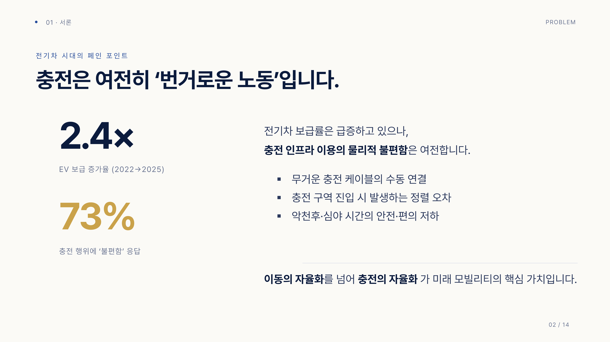
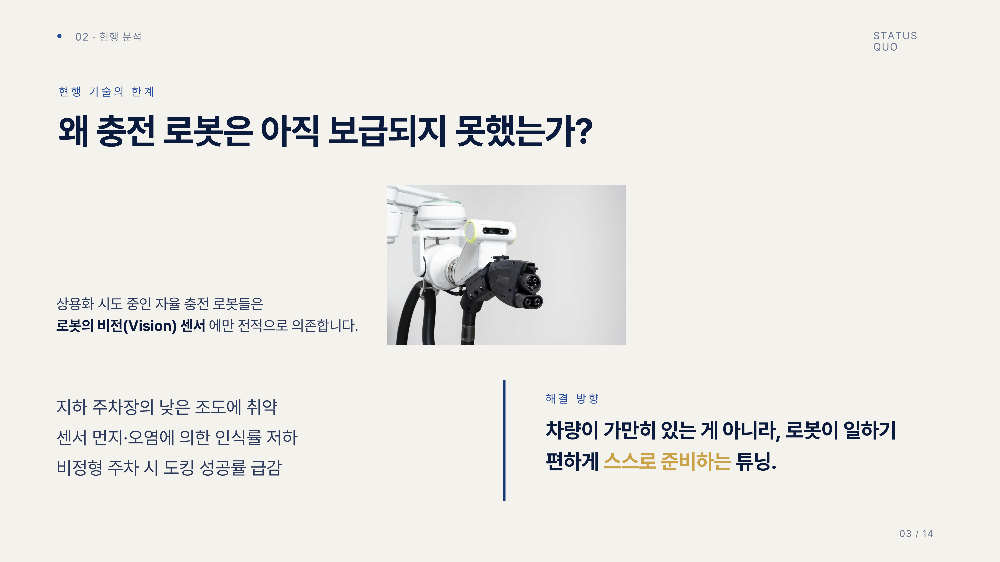
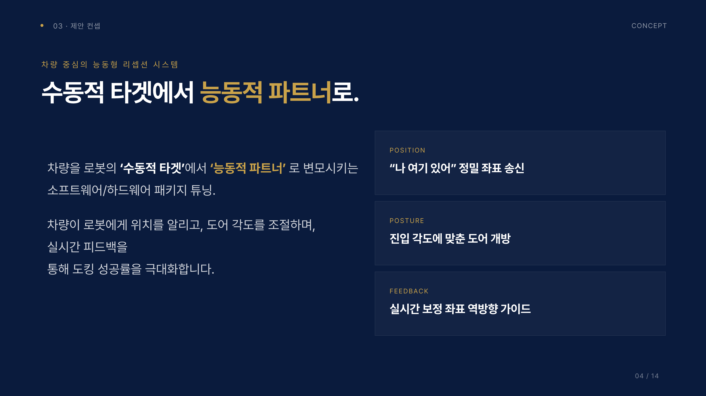
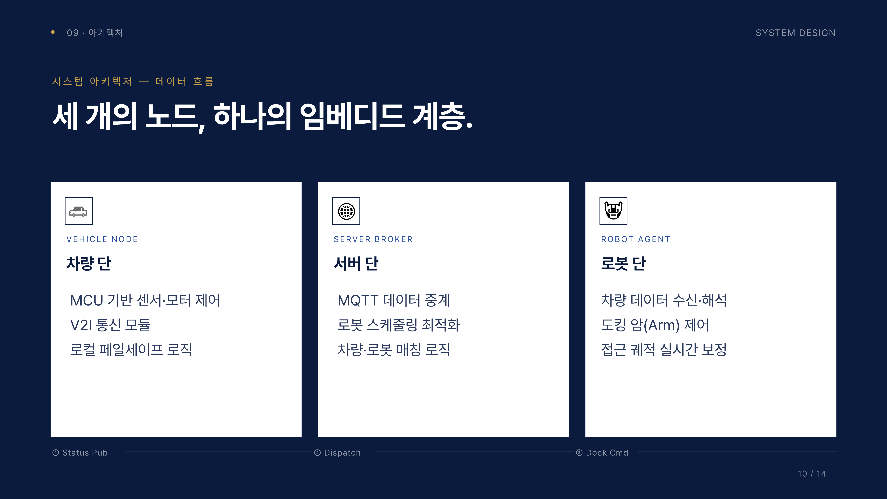
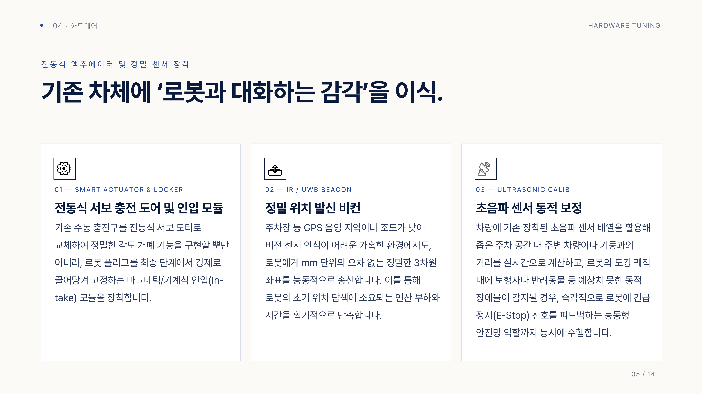
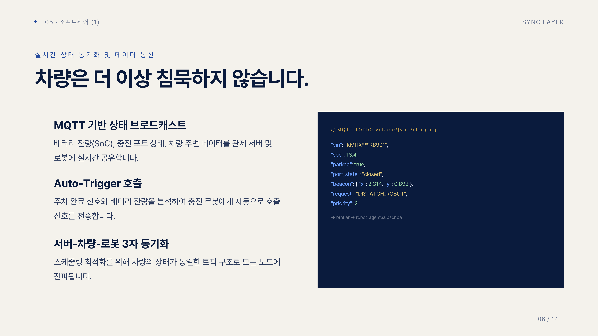
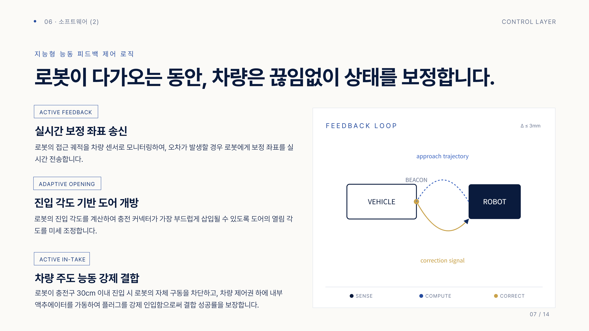
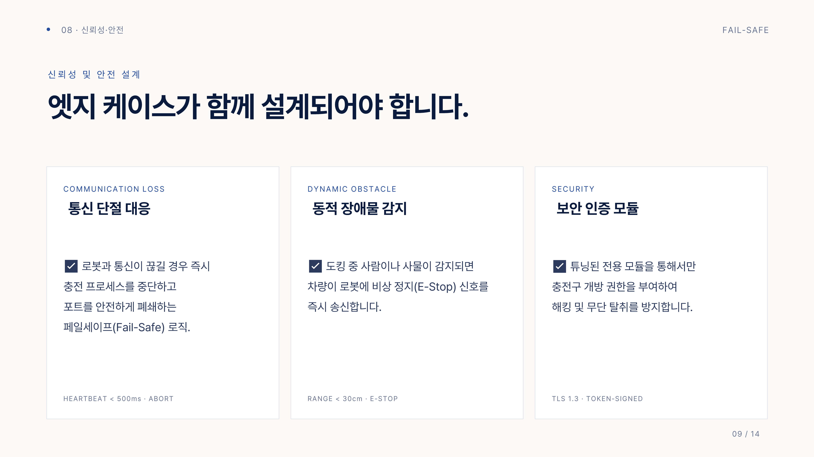
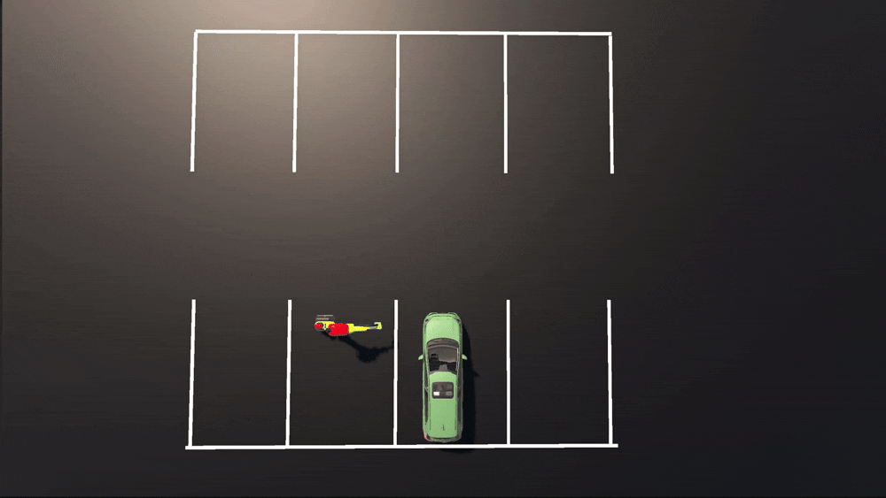
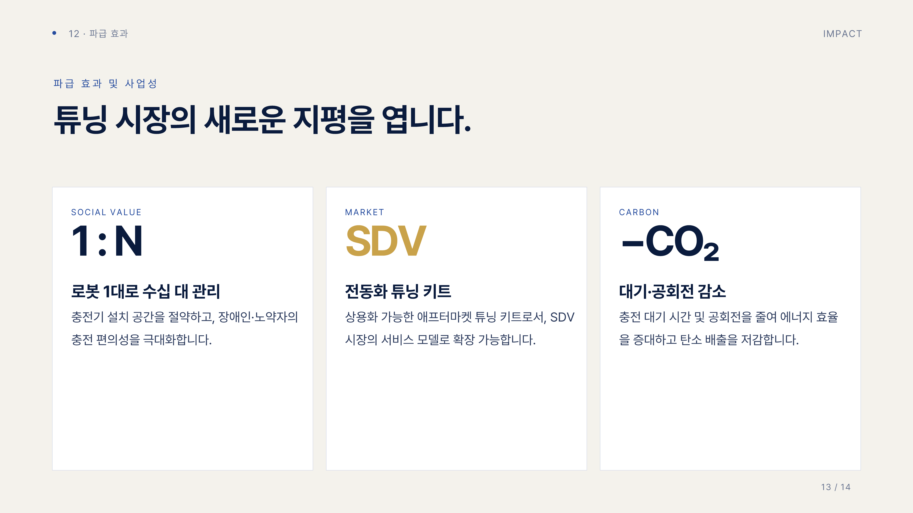

# 🔌 Plug-Tune: 전기차를 위한 능동형 도킹 인터페이스 튜닝
#### 인프라 중심 기술의 한계를 넘는 차량 중심 V2I 협력 모델 제안

 

## 🎉 Achievement

- 제1회 튜닝 아이디어 경진대회 **일반부 본선** 진출

- **미래차 전환시대 튜닝 혁신 포럼** 본선 **무대 발표작**

## 🚨 Background (문제 의식)
전기차 보급률은 급증하고 있으나, 충전은 여전히 사용자에게 번거로운 노동(불편함 응답률 73%)으로 남아 있습니다. 자율 충전 로봇이 상용화를 시도 중이지만, 로봇의 **비전(Vision) 센서에만 전적으로 의존하는 기존 방식은 지하 주차장의 낮은 조도, 센서 오염, 비정형 주차 환경에서 심각한 인식률 저하와 도킹 실패**를 겪고 있습니다.
 

## 💡 Solution
#### 로봇을 비싸게 만드는 대신, 차량을 로봇이 일하기 편하게 가이드하는 '수동적 타겟'에서 '능동적 파트너'로 변모시키는 튜닝을 제안합니다.

 

## 🧩 System Architecture
본 프로젝트는 세 개의 노드(차량, 서버, 로봇)를 하나의 임베디드 계층으로 묶어 지연 없는 협력 통신을 구현합니다.

 

## 🛠️ Hardware Tuning (차량 측 하드웨어)
1. **스마트 서보 액추에이터 및 인입 모듈**: 로봇 플러그가 30cm 이내 접근 시, 자석처럼 강제로 끌어당겨 완벽히 결합시키는 능동 인입(Active In-take) 기구부.

2. **정밀 UWB 비컨**: GPS 음영 지역에서도 mm 단위의 정밀한 3차원 위치 좌표를 능동 송신.

3. **초음파 센서 동적 보정**: 기존 차량의 초음파 센서를 활용하여 장애물을 감지하고 최적의 도어 개방 반경 확보.

## 👩‍💻 Software Sync & Control Layer (차량 및 로봇 측 소프트웨어 제어)
1. **Auto-Trigger & MQTT Sync**: 주차 완료 시 차량 배터리(SoC)를 분석해 로봇을 자동 호출하며, MQTT 프로토콜로 3자(서버-차량-로봇) 간 상태 지연 없이 동기화.

2. **Active Feedback (실시간 보정)**: 로봇 접근 궤적의 오차 발생 시 차량이 보정 좌표를 역송신.

3. **Adaptive Opening**: 진입 각도에 맞춰 충전 도어의 열림 각도를 미세 조정.

 

## 🛡️ Failsafe & Reliability (안전 설계)
시스템의 무결성을 보장하기 위해 엣지 케이스(Edge Case)에 대한 철저한 방어 로직을 구축했습니다.

- **Communication Loss**: 통신 단절(Heartbeat 누락) 시 즉각 충전 프로세스 중단 및 포트 폐쇄.

- **Dynamic Obstacle**: 도킹 반경 내 보행자/사물 감지 시 차량 주도로 로봇에 긴급 제동(E-Stop) 신호 송신.

- **Security**: 전용 인증 토큰(TLS 기반)을 통한 해킹 및 충전구 무단 개방 원천 차단.

## 💻 Simulation & Validation (디지털 트윈 검증)
물리적 개조 전, 하드웨어 통신과 동일한 환경을 구축하여 제어 알고리즘의 무결성을 검증했습니다.

- 환경: Unity 3D 및 C# 스크립트 기반 디지털 트윈 구축 (ROS2 통신 개념 차용).

- 검증 시나리오:

1. **능동 인입 (Active In-take) 시퀀스**: 로봇 반경 30cm 진입 시 로봇 구동 정지 및 차량 내부 상태 머신(State Machine)으로 제어권이 완벽히 이관되는 로직 테스트.

2. **동적 장애물 감지**: 협력형 비상 정지(E-Stop) 발동 트리거 확인.

3. **통신 레이턴시**: 센서 퓨전(Sensor Fusion)을 통한 오차 극복 및 웨이크업(Wake-up) 알고리즘 검증.

 

## 🚀 Impact (파급 효과)
- **1:N 인프라 관리**: 로봇 1대가 수십 대의 차량을 순차 관리하여 국가/지자체의 주차장 인프라 구축 예산 및 공간 절약.

- **교통약자 배려**: 신체적 제약이 있는 운전자의 완벽한 충전 기본권 보장 (Zero-Touch).

- **범용 튜닝 키트**: 제조사에 국한되지 않는 V2I 통신 표준화 기반의 애프터마켓 전동화 키트로 SDV 생태계 확장.

## ⚙️ Tech Stack
- Simulation: `Unity 3D`

- Language/Logic: `C#` (State Machine Design)

- Protocol Context: `MQTT`, `UWB/IR Sensor Logic`, `ROS 2 Concept`